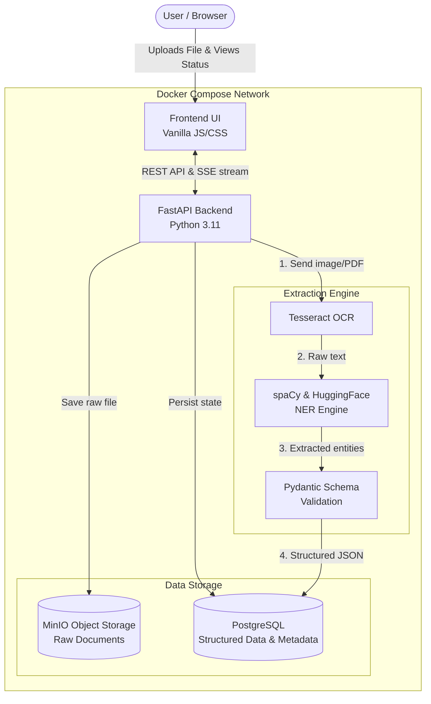
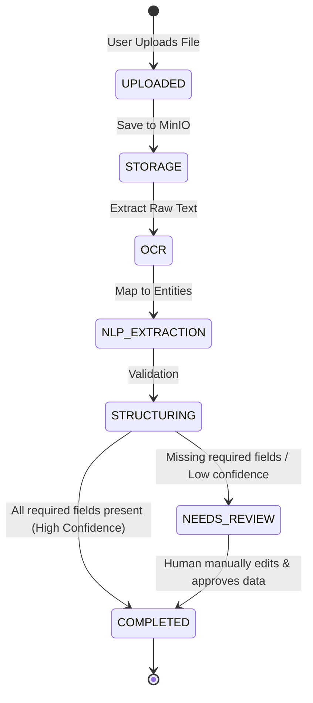

# Docxtract — NLP Document Intelligence Pipeline

<div align="center">
  
  
  
  
  
</div>

<br>

**Docxtract** is an advanced, self-hosted web application that transforms unstructured documents (such as Business Cards, Resumes, and Medical Reports) into highly accurate, structured, machine-readable JSON data using Natural Language Processing (NLP).

## ✨ Key Features

- 🧠 **Robust NLP Pipeline**: Leverages a combination of spaCy Named Entity Recognition (NER), custom regular expressions, and layout-aware heuristics to reliably extract key fields even from complex layouts like Resume headers.
- ⚡ **Real-Time Progress Tracking**: A live, animated Server-Sent Events (SSE) pipeline tracker keeps you informed across all 6 processing phases (Upload → Storage → OCR → NER Extraction → Structuring → Done).
- ✏️ **Manual Data Review & Editing**: A built-in JSON editor modal allows human reviewers to manually correct or append fields when the NLP engine isn't 100% confident. 
- 📊 **Export Capabilities**: Instantly download extracted structured data in `.json` or `.csv` formats.
- 🎨 **Modern, Premium UI**: A sleek, fully responsive dark-mode Single Page Application (SPA) featuring drag-and-drop file uploads, dynamic confidence scoring bars, and smooth transitions.

---

## 🏗 Architecture

Docxtract follows a decoupled service architecture orchestrated via Docker Compose:



### Document Processing Lifecycle

The pipeline processes unstructured files synchronously and emits Server-Sent Events (SSE) so the frontend can display a real-time progress bar. Once extraction is finished, the document is either automatically completed or routed to humans for review.



---

## 🚀 Quick Start

The easiest way to run the full application (including PostgreSQL and MinIO) is using Docker Compose.

### Prerequisites
- Docker & Docker Compose installed on your system.

### Running the App

```bash
# Clone the repository
git clone https://github.com/mohamedmostafam0/NLP-Document-Extractor.git
cd NLP-Document-Extractor

# Build and start the services
docker compose up -d --build
```

Wait a few seconds for the database and storage services to initialize, then open your browser:
- **Docxtract Dashboard**: [http://localhost:8000](http://localhost:8000)
- **MinIO Console**: [http://localhost:9001](http://localhost:9001) *(Credentials: `docxtract` / `docxtract123`)*

---

## 🛠 Local Development

If you prefer to run the application locally without Docker (e.g., for active development):

1. **Install System Dependencies** (Ubuntu/Debian example):
   ```bash
   sudo apt-get update
   sudo apt-get install tesseract-ocr libtesseract-dev
   ```

2. **Set up a Virtual Environment**:
   ```bash
   python -m venv venv
   source venv/bin/activate
   pip install -r requirements.txt
   python -m spacy download en_core_web_sm
   ```

3. **Start External Services**:
   Ensure you have a local or Dockerized PostgreSQL and MinIO instance running. You will need to define a `.env` file referencing your `DATABASE_URL` and `MINIO_ENDPOINT`.

4. **Run the FastAPI Server**:
   ```bash
   uvicorn main:app --reload --port 8000
   ```

---

## 📄 Supported Document Types & Extraction Schemas

If a document fails to extract any of its **Required Fields**, the pipeline will automatically flag its status as `needs_review` and route it to the "Review Queue" for manual human validation via the dashboard UI.

### 1. Resumes (`resume`)
- **Required**: `name`, `email`
- **Optional**: `phone`, `location`, `education` (List), `experience` (List), `skills` (List)

### 2. Business Cards (`business_card`)
- **Required**: `name`, `email`
- **Optional**: `title`, `company`, `phone`, `address`, `website`

### 3. Medical Reports (`medical_report`)
- **Required**: `patient_name`, `visit_date`
- **Optional**: `date_of_birth`, `provider`, `diagnoses` (List), `medications` (List), `vitals` (Dictionary)

## 🤝 Contributing
Pull requests are welcome. For major changes, please open an issue first to discuss what you would like to change. Ensure to update tests as appropriate.
